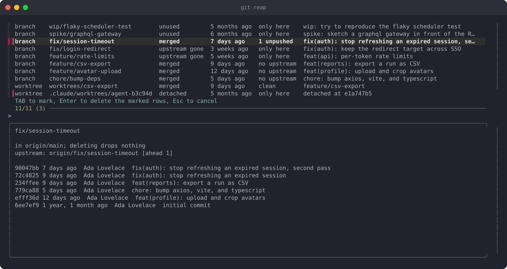
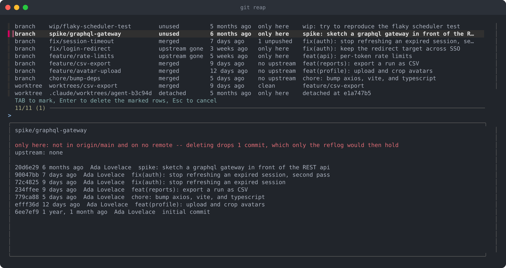

# git-reap

Delete old branches, and the worktrees sitting on them.

Handles several types of branches that pile up: merged, squash-merged whose
remote branch is gone, ideas abandoned long ago, and — especially for
agent-based development — detached worktrees like those under
`.claude/worktrees`. `git reap` finds all four, shows you what it
found, and deletes only what you pick using `fzf`.



- **Worktrees, not just branches.** Branch cleaners leave worktrees where they
  lie, and a worktree holding a branch is exactly what stops the branch from
  being deleted. `git reap` removes both, in that order.
- **The ones agents leave behind.** Detached worktrees drifting under
  `.claude/worktrees` — what Claude Code and similar tooling leave when a task
  ends — are found by age, not by path, so any layout works.
- **Four reasons, one pass.** Merged, upstream gone, unused, detached: the
  squash-merged pull request and the six-month-old spike are as findable as the
  cleanly merged branch.
- **You pick.** Candidates go through [fzf](https://github.com/junegunn/fzf)
  with each one's recent history in the preview pane. Nothing is deleted that
  you did not mark.
- **It says what you would lose.** Every row says where its commits live, and
  the ones that are `only here` — in neither the base nor any remote — say so in
  red in the preview pane, with the number of commits at stake. `--dry-run` and
  the confirmation count them before you agree to anything.
- **It says what it skipped.** `--dry-run` lists the candidates *and* everything
  it left alone, with the reason for each — and every row it does offer is a
  deletion that will really happen.
- **Nothing to configure.** No config file, no state, no remote API, no token.
  One binary, and `git` and `fzf` on your `PATH`.



## What qualifies for deletion

| Reason          | What it means                                                                           |
| --------------- | --------------------------------------------------------------------------------------- |
| `merged`        | the branch is already contained in the base branch                                      |
| `upstream gone` | the remote branch was deleted — what a squash-merged, closed pull request leaves behind |
| `unused`        | no commits on the branch in the last `--days` days (90 by default)                      |
| `detached`      | a clean worktree on a detached HEAD, untouched for `--days` days                        |

Worktrees are removed before branches, because git refuses to delete a branch
that a worktree has checked out.

For a branch, `--days` counts from its last commit. For a detached worktree it
counts from when the worktree itself was last used, which is not the same
thing: agent tooling branches from whatever commit is to hand, so a worktree
created minutes ago routinely sits on a months-old one, and reading the commit
date would offer to delete a worktree somebody is working in.

Every row also says where its commits live, which is the part worth reading
before you mark anything:

| State           | What it means                                                                      |
| --------------- | ---------------------------------------------------------------------------------- |
| `pushed`        | the remote branch has everything this one does                                     |
| `N unpushed`    | N commits are not on the remote branch — the reason column says where they are     |
| `no upstream`   | the branch never had a remote branch of its own                                    |
| `upstream gone` | the remote branch was deleted                                                      |
| `only here`     | in neither the base nor any remote: deleting really does drop these commits        |

`only here` is the one to look at. Everything else is recoverable from somewhere
that is not your reflog, so the preview pane spells out in red how many commits
an `only here` row would take with it, and `--dry-run` and the `--all`
confirmation count those rows before anything happens. Set `NO_COLOR` to keep
the red out of it.

**Never touched:** the base branch, the branch you are on, the branch the main
worktree holds, the main worktree itself, any worktree that is locked, has
uncommitted changes, or is the one you are standing in. And any branch that is
none of the four above.

A branch that one of those worktrees has checked out is not offered either,
however well it qualifies: git will not delete a branch out from under a
worktree, so the row would be one you could mark and watch do nothing. It is
reported as kept, naming the worktree in the way — deal with that worktree and
the next run will offer the branch.

## Install

With Go 1.22 or newer:

```sh
go install github.com/m-d-brown/git-reap@latest
```

Or from a clone:

```sh
git clone https://github.com/m-d-brown/git-reap
cd git-reap
go build -o ~/bin/git-reap .
```

Anything named `git-reap` on your `PATH` is reachable as `git reap`, so
that is all the installation there is. [fzf](https://github.com/junegunn/fzf) is
what makes the picker work; without it, `--dry-run` and `--all` still do.

## Usage

```
usage: git reap [options] [base]

Delete merged, gone, and unused branches and their worktrees.

  base            branch to measure 'merged' against (default: origin/HEAD,
                  falling back to origin/main, origin/master, main, master)

options:
  -n, --dry-run   list the candidates, and what was skipped, without deleting
  -a, --all       take every candidate instead of picking through fzf
  -y, --yes       skip the confirmation prompt that --all asks for
  -d, --days N    how quiet something must be to count as unused: for a branch,
                  since its last commit; for a detached worktree, since it was
                  last used (default: 90)
      --no-fetch  skip the 'git fetch --prune' that refreshes remote state
      --debug     print the state behind every decision -- how the base
                  resolved, and why each branch was offered or passed over --
                  and delete nothing
  -h, --help      show this message
```

Run it with no arguments and pick through the list: <kbd>TAB</kbd> marks a row,
<kbd>Enter</kbd> deletes what is marked, <kbd>Esc</kbd> walks away. The preview
pane shows the recent history of whatever the cursor is on.

```sh
git reap                # pick through the candidates
git reap -n             # just look, and see what was skipped and why
git reap -a -y          # take everything, no questions
git reap -d 30          # count a month of silence as unused
git reap develop        # measure "merged" against develop
```

`--dry-run` also explains its omissions, which is usually where the interesting
information is:

```
worktree  .claude/worktrees/agent-7f21e0  detached       5 months ago  only here    detached at b3716afd
worktree  .claude/worktrees/agent-b3c94d  detached       4 months ago  only here    detached at 17eacec5
worktree  worktrees/csv-export            merged         9 days ago    clean        feature/csv-export
branch    chore/bump-deps                 merged         5 days ago    no upstream  chore: bump axios, vite, and typescript
branch    feature/avatar-upload           merged         12 days ago   no upstream  feat(profile): upload and crop avatars
branch    feature/csv-export              merged         9 days ago    no upstream  feat(reports): export a run as CSV
branch    feature/rate-limits             upstream gone  5 weeks ago   only here    feat(api): per-token rate limits
branch    fix/login-redirect              upstream gone  3 weeks ago   only here    fix(auth): keep the redirect target across SSO
branch    fix/session-timeout             merged         7 days ago    1 unpushed   fix(auth): stop refreshing an expired session, se…
branch    spike/graphql-gateway           unused         6 months ago  only here    spike: sketch a graphql gateway in front of the R…
branch    wip/flaky-scheduler-test        unused         5 months ago  only here    wip: try to reproduce the flaky scheduler test
kept    worktree .claude/worktrees/agent-e5a018 (detached but recent)
kept    worktree worktrees/invoice-pdf (3 uncommitted files)
kept    branch   feature/invoice-pdf (checked out at worktrees/invoice-pdf, which is kept: 3 uncommitted files)
6 rows are "only here": not in origin/main and on no remote -- deleting drops those commits
```

`fix/session-timeout` is the row worth looking twice at: it is in `origin/main`,
so nothing is lost by deleting it, but one commit never reached
`origin/fix-session-timeout` — which is the ref `git branch -d` measures it
against, and the reason it needs `-D`.

`feature/invoice-pdf` is the pair at the bottom: the branch is merged and would
otherwise be offered, but the worktree on it is holding three uncommitted files,
and git will not delete a branch out from under a worktree. Neither is offered,
and both say why.

## How it decides

Each run starts with `git fetch --prune`, which is what makes `[gone]` mean
anything: until the remote refs are pruned, a branch whose upstream was deleted
still looks alive. Pass `--no-fetch` when you are offline.

The base branch is `origin/HEAD` — the default branch your clone recorded. If
your clone never recorded one, `git remote set-head origin -a` fixes that;
failing that, `git reap` tries `origin/main`, `origin/master`, `main`, and
`master`, and you can always name a base yourself.

Branches go out with `git branch -d` wherever git will accept it, so git keeps
the last word, and with `-D` where it would not. Which one that is cannot be
read off the reason, because `-d` asks a different question than `git reap`
does: it wants the branch contained in **its upstream** — or in `HEAD`, when it
has no upstream — while `merged` here means contained in **the base**. A branch
sitting safely in `origin/main` but one commit ahead of `origin/my-branch`
fails git's check and passes this one, so `git reap` works out up front which
branches those are and forces exactly them.

That is a question about refs, not about safety. The safety question is the
`only here` column above, and the two do not line up: a `merged` branch can
need `-D` and still cost you nothing, while an `unused` branch that git is
perfectly willing to `-D` may be the only place its commits exist.

## Troubleshooting

`--debug` prints the state behind every decision: how the base resolved and by
which rule, what each worktree looks like on disk, where each branch's commits
sit, and an explanation for every branch that was passed over.

```
## the base
origin/main  origin/HEAD, the default branch this clone recorded
             'merged' below means contained in this ref.

## worktrees
path                            on                    state                                 last commit   last used      outcome
.                               main                  dirty (2 uncommitted files), in base  7 days ago    8 seconds ago  the main worktree, never removed
.claude/worktrees/agent-7f21e0  detached at b3716afd  clean, not in base                    6 months ago  5 months ago   offered (detached)
.claude/worktrees/agent-e5a018  detached at 610864d2  clean, in base                        7 days ago    8 seconds ago  kept: detached but recent
worktrees/invoice-pdf           feature/invoice-pdf   dirty (3 uncommitted files), in base  2 weeks ago   8 seconds ago  kept: 3 uncommitted files

## branches
branch                  upstream                    track   in base  in HEAD  outcome
feature/billing-portal  none                        -       no       no       not merged, upstream not gone, last commit 24 hours ago
feature/invoice-pdf     none                        -       yes      yes      kept (merged): checked out at worktrees/invoice-pdf, which is kept: 3 uncommitted files
feature/rate-limits     origin/feature/rate-limits  [gone]  no       no       offered (upstream gone)
main                    origin/main                 -       yes      yes      protected: the base
```

The base is worth reading first: a clone with no `origin/HEAD` falls back to
`origin/main`, `origin/master`, `main`, `master`, and a base that quietly
resolved to something other than what you assumed is behind most empty runs.

## Compared to other tools

The `git branch --merged | xargs git branch -d` one-liner everyone keeps in
their dotfiles also deletes merged branches, and does it well. Two things are
different here.

Worktrees are first-class. Operating on branches alone leaves the worktree on
disk and, because git will not delete a branch a worktree has checked out,
sometimes leaves the branch too. And a branch does not have to be
merged to be finished: `git reap` also takes the squash-merged branch whose
upstream is gone, and the branch nobody has touched in three months, which is
what most abandoned work actually looks like.

## Development

```sh
make check    # gofmt, vet, and tests -- exactly what CI runs
make          # list every target
make demo     # a repository with one of everything, to try the picker against
```

`make check` is the whole gate: CI runs that target rather than its own copy of
the steps, so passing it here is passing it there.

The integration test builds the binary and runs it against a temporary
repository holding one of everything — a merged branch, a squash-merged branch
whose upstream is gone, an idle branch, an active branch, and worktrees that are
merged, dirty, idle-detached, freshly detached, and detached on an old commit
but recently used — with a bare repository next
door standing in for the remote, so the fetch is real but offline.

The screenshots above are not mockups, and they are not hand-maintained:

```sh
scripts/screenshot.sh
```

builds the binary, builds a demo repository with something of each kind left
lying around in it (`scripts/demo-repo.sh`), and runs the real picker against
that in a pty twice, drawing each screen it left behind (`scripts/capture.py`)
into `docs/screenshot.png` and `docs/screenshot-warning.png`. Commit dates in
the demo are relative to today, so the ages hold still between runs; the
hashes move, because they hash those dates. Needs `fzf`, `rsvg-convert`, and
`python3` with [pyte](https://pypi.org/project/pyte/).

Rather than installing those, open the repository in a Dev Containers-capable
editor and let `.devcontainer/` supply them. It pins them to what Debian
stable ships, so the picture does not drift when `fzf` cuts a release, and it
installs a monospace font for `rsvg-convert` to draw with — without one the
text falls back to a proportional face and the columns wander.

## License

MIT
